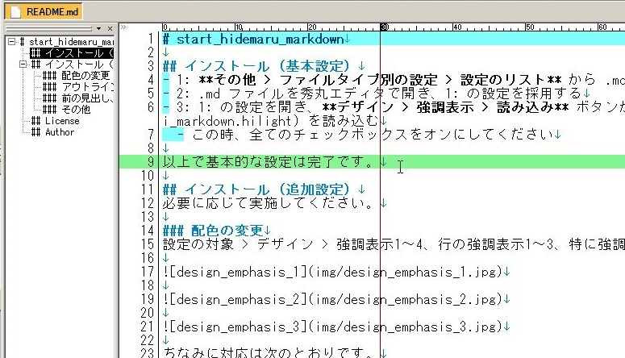
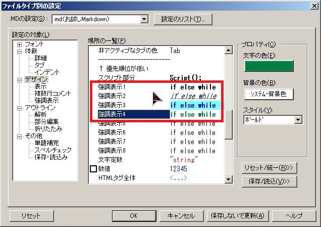
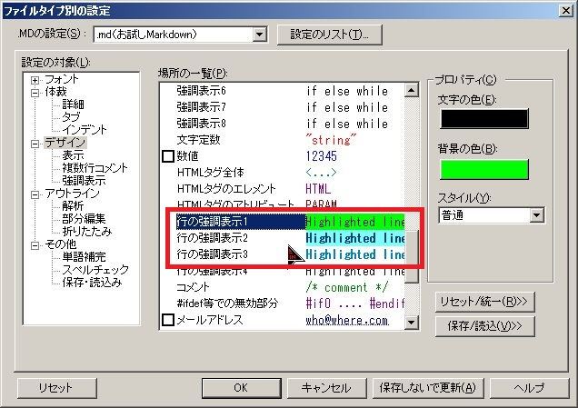
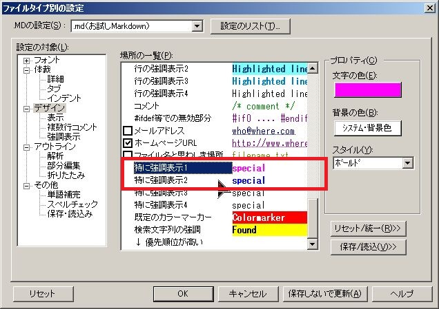
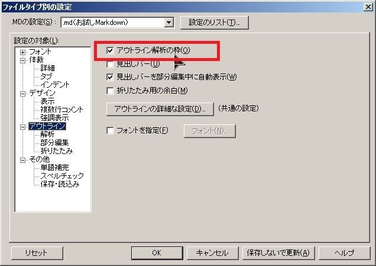

# start_hidemaru_markdown

## インストール（基本設定）
- 1: **その他 > ファイルタイプ別の設定 > 設定のリスト** から .md ファイル用の設定を適当につくる
- 2: .md ファイルを秀丸エディタで開き、1: の設定を採用する
- 3: 1: の設定を開き、**デザイン > 強調表示 > 読み込み** ボタンから [md_otameshi_markdown.hilight](md_otameshi_markdown.hilight) を読み込む
  - この時、全てのチェックボックスをオンにしてください

以上で基本的な設定は完了です。

## インストール（追加設定）
必要に応じて実施します。

- 配色の変更
- 「アウトライン解析の枠」の有効化
- 前後の見出しに移動する操作の利用

### 配色の変更
設定の対象 > デザイン > 強調表示1～4、行の強調表示1～3、特に強調表示1～2 をお好みの配色に変更してください。

ちなみに対応は次のとおりです。

- 強調表示1：太字
- 強調表示2：斜体
- 強調表示3：箇条書き
- 強調表示4：整形済みテキスト（文中）
- 行の強調表示1：水平線
- 行の強調表示2：大見出し
- 行の強調表示3：中見出し、小見出し、……
- 特に強調表示1：かぎ括弧「」
- 特に強調表示1：二重かぎ括弧『』

ちなみに筆者環境では以下のような配色にしています。

### アウトライン解析の枠を使う
アウトライン > アウトライン解析の枠 にチェックを入れます。

### 前の見出し、次の見出しに移動する
その他 > キー割り当てより、以下の割り当てを行います。

- Alt + Up: カーソル移動系 > 前の見出し
- Alt + Down: カーソル移動系 > 次の見出し

これにより Alt + Up/Down で前後の見出しにサクサク移動できて便利です。

### その他
その他にも気に入らない設定があれば適当に変えてください。

## License
[MIT License](LICENSE)

## Author
[stakiran](https://github.com/stakiran)
